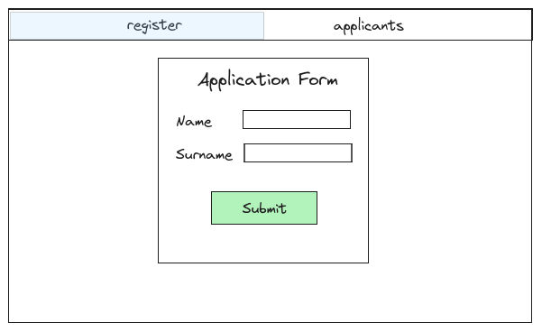
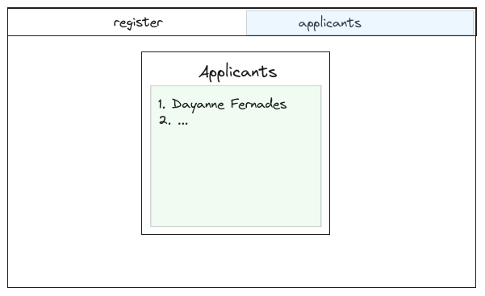

# 1st challenge: Basic web project

## Install the basic tools

Ruby + Rails: First off, start this challenge by installing the Ruby and Rails versions that the `Decidim` project utilizes (it will be better to learn the version syntax they already use because we have a time constraint).

Postgresql: Afterwards install the postgresql in your machine. Even though you are going to use docker, it's good to have the Postgresql installed in your local machine so that you can easily debug locally before moving forward to learn Docker.

Docker + docker-compose: Install these two, and make sure it's up and running.  

## Incrementally test the tools

You could go directly to this tutorial ([Create an web application with Ruby on Rails + Postgresql + docker-compose](https://danielabaron.me/blog/rails-postgres-docker/)) and follow the steps, or instead, you can incrementally test the tools so that it will be easier to understand each part of the challenge. Below is the study steps suggestion:

- Install Ruby and test the ruby's basics.
- Raise and catch exception on Ruby ([Link](https://ruby-doc.com/docs/ProgrammingRuby/html/tut_exceptions.html)).
- Install Rails and practice by editing the blog application instructed [here](https://guides.rubyonrails.org/getting_started.html). Make sure you understand the Action Controller ([Link](https://guides.rubyonrails.org/action_controller_overview.html)) and Action View ([Link](https://guides.rubyonrails.org/action_view_overview.html))
- Learn about API Rest ([Link](https://blog.postman.com/rest-api-examples/)).
- Learn about SQL basics, ORM and ORM on Rails, the Active Record. ([SQL basics](https://blog.hubspot.com/marketing/sql-tutorial-introduction), [ORM](https://www.freecodecamp.org/news/what-is-an-orm-the-meaning-of-object-relational-mapping-database-tools/), [ORM on Rails, Active Record](https://guides.rubyonrails.org/active_record_basics.html))
- Install Postgresql locally and play with a local DB ([Link](https://www.postgresql.org/docs/current/tutorial.html)).
- Install docker and docker-compose and setup a Postgresql server with docker-compose. Create and edit a Postgresql DB that was created using a docker container ([docker](https://docs.docker.com/get-started/) and [docker-compose](https://blog.4linux.com.br/docker-compose-explicado/)).
- Try to join altogether. The Rails basic tutorial teaches SQLite3, try to replace the SQLite to Postgresql, and create your Blog application with Ruby + Rails inside a docker, setting the docker-compose to raise the Rails and Postgresql ([Example on how to join altogether](https://danielabaron.me/blog/rails-postgres-docker/)).

## Build your own application

Now, let's build your own application. Create a job application web page, where you would need to provide a page to the applicants to register with their name and surname and the second page with a list of all the applicants that already registered to it. Example below:

Register page:

List page:

Feel free to use any UI template and JS framework. The goal here is to use Ruby on Rails, setup your DB tables with Postgresql and build your infrastructure using docker and docker-compose.

## References to study

- [OK] Create an web application with Ruby on Rails + Postgresql + docker-compose: https://danielabaron.me/blog/rails-postgres-docker/
- [TODO] Debugging on Rails: https://guides.rubyonrails.org/v6.1/debugging_rails_applications.html
- [TODO] Ruby exceptions: https://ruby-doc.com/docs/ProgrammingRuby/html/tut_exceptions.html
- [OK] Rails: https://guides.rubyonrails.org/getting_started.html
- [TODO] ORM: https://www.freecodecamp.org/news/what-is-an-orm-the-meaning-of-object-relational-mapping-database-tools/
- [TODO] ORM on Rails, Active Record: https://guides.rubyonrails.org/active_record_basics.html
- [TODO] SQL basics: https://blog.hubspot.com/marketing/sql-tutorial-introduction
- [TODO] Postgresql: https://www.postgresql.org/docs/current/tutorial.html
- [TODO] docker:
    - [TODO] https://www.freecodecamp.org/news/how-docker-containers-work/
    - [TODO] https://docs.docker.com/get-started/
    - [TODO] Play with docker: https://labs.play-with-docker.com
- [TODO] docker-compose: https://blog.4linux.com.br/docker-compose-explicado/
- [TODO] API REST: https://blog.postman.com/rest-api-examples/

## Skills

Skills to unlock:
- Rails 6.1.0 and 7.1.0 [OK]
- How to debug on Rails. [TODO]
- How to raise and catch exceptions on ruby. [TODO]
- The web framework for ruby called Rails. [OK]
- Learn about MVC (Model-View-Controller) web design pattern. [OK]
- The concept of ORM (object relational mapper). [TODO]
- The API protocol REST / RESTful (representational state transfer). [TODO]
- How to create APIs with Ruby on Rails. [TODO]
- How to create / maintain a local DB. [OK]
- How to insert and fetch data from a Postgresql DB. [OK]
- Understand the concept of Docker and learn to setup multiple images with docker-compose. [TODO]
- Build a minimal web backend project from zero with Ruby on Rails + Postgresql + docker-compose. [OK]
- Design DB tables. [TODO]

## Retrospective

TODO:
- ...

The good:
- The challenge was 90% completed, she was able to get the pieces together, ruby on rails, docker-compose and postgresql.
- She learned the basics of 2 important versions of Rails in one week.  
- She learned the basic of web and one of the most version web design pattern, MVC.
- She learned to use postgresql using its cli and was able to add and retrieve information in the application.
- She felt good when she created the front end components.
- There was comprehension of the connection between the web architecture, how does each piece connects with each other.

The bad:
- Ruby.
- The huge difference between rails versions 6.1 and 7.1, some time was lost learning versions.
- She struggle a lot on back end and comparing to front end and it felt way harder.
